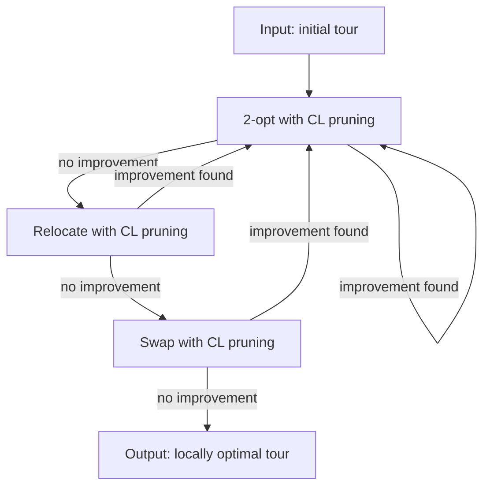
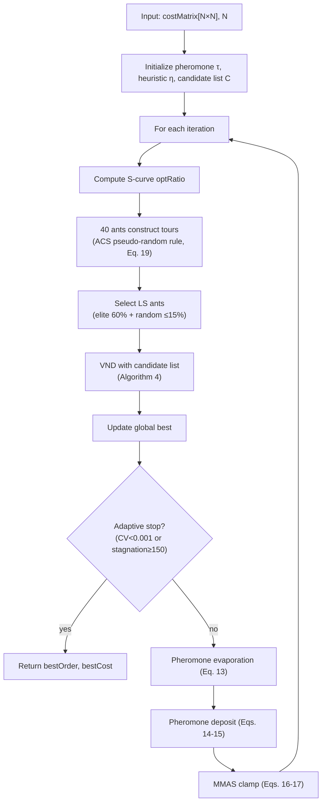

## 4.3 Improved Ant Colony Optimization for Open TSP

The second layer of our framework solves the open Traveling Salesman Problem on the cost matrix produced by the global planning layer. Given $N$ points consisting of a fixed start $S$, $K$ intermediate target points $\{T_1, \dots, T_K\}$, and a fixed goal $G$, the objective is to find the permutation of the $K$ targets that minimizes the total path cost. We build on the Ant Colony Optimization (ACO) metaheuristic and introduce five integrated mechanisms: (i) an open-TSP pheromone model that treats start and goal as fixed boundaries, (ii) Max-Min Ant System (MMAS) pheromone management with dynamically updated bounds, (iii) an Ant Colony System (ACS)-style pseudo-random proportional transition rule balancing exploration and exploitation, (iv) Variable Neighborhood Descent (VND) local search accelerated by a $k$-nearest-neighbor candidate list, and (v) an S-curve progressive scheduling strategy that gradually shifts the search from exploration-dominated to exploitation-dominated.

### 4.3.1 Open TSP Encoding and Pheromone Model

**Motivation.** In a standard closed TSP, the solution is a Hamiltonian cycle and any city can serve as the starting point. In our problem, the start $S$ and goal $G$ are physically distinct locations determined by the mission specification—for instance, a shuttle's departure depot and its final destination. These two points must appear at fixed positions (first and last) in every candidate solution, and the optimization is over the ordering of the $K$ intermediate targets only. A naive encoding that treats all $N$ points as symmetrically permutable would generate invalid tours mixing start/goal into the middle sequence.

**Mechanism.** We adopt a boundary-fixed encoding. Let the complete point set be indexed as $P = \{1, 2, \dots, N\}$ where index $1$ is always the start $S$ and index $N$ is always the goal $G$. The $K = N - 2$ intermediate points occupy indices $M = \{2, 3, \dots, N-1\}$. A candidate solution is encoded as a permutation $\boldsymbol{\pi} = (\pi_1, \pi_2, \dots, \pi_K)$ of the index set $\{1, \dots, K\}$, which maps to the actual visit order via the index mapping:

$$\text{tour} = [1,\; m(\pi_1),\; m(\pi_2),\; \dots,\; m(\pi_K),\; N] \quad (10)$$

where $m(i) = i + 1$ maps the internal permutation index to the global point index in $M$. The start ($1$) and goal ($N$) are prepended and appended respectively and never participate in permutation.

All ACO data structures—the pheromone matrix and the heuristic visibility matrix—are defined over the $K \times K$ internal space. For $i, j \in \{1, \dots, K\}$:

$$\eta_{ij} = \frac{1}{d_{ij}}, \quad d_{ij} = \text{costMatrix}(m(i), m(j)) \quad (11)$$

where $d_{ij}$ is the obstacle-aware path cost between the corresponding global points, obtained from the global planning layer (Section 4.1). Entries with $d_{ij} = 0$ or $d_{ij} = \infty$ (unreachable pairs) are assigned $\eta_{ij} = 0$, effectively blocking those transitions.

The cost of a candidate tour is computed by mapping back to global indices and summing the segment costs including the boundary connections:

$$C(\boldsymbol{\pi}) = \text{cost}(1, m(\pi_1)) + \sum_{k=1}^{K-1} \text{cost}(m(\pi_k), m(\pi_{k+1})) + \text{cost}(m(\pi_K), N) \quad (12)$$

where $\text{cost}(i, j)$ retrieves the entry from the precomputed global cost matrix. This encoding reduces the search space from $N!$ (closed TSP over all points) to $K!$ (permutation of intermediate points only), while correctly modeling the physical constraint of distinct start and end locations.

### 4.3.2 MMAS Pheromone Update with Dynamic Bounds

**Motivation.** In the basic Ant System, all ants deposit pheromone on their complete tours, which can cause the search to prematurely concentrate on suboptimal solutions when a few ants happen to find moderately good paths early. Conversely, excessive evaporation without bounds can cause pheromone values to approach zero on all but the dominant edges, trapping the colony in local optima. The Max-Min Ant System (MMAS) addresses both issues by (a) limiting pheromone to an explicit interval $[\tau_{\min}, \tau_{\max}]$, preventing both domination and extinction, and (b) focusing deposit on the best-performing solutions.

**Mechanism.** At each iteration, all pheromone values first undergo evaporation:

$$\tau_{ij} \leftarrow (1 - \rho) \cdot \tau_{ij} \quad \forall i, j \in \{1, \dots, K\} \quad (13)$$

where $\rho = 0.25$ is the evaporation rate. After evaporation, pheromone is deposited on the edges of two solution levels:

**Iteration-best deposit.** The best ant of the current generation deposits pheromone on all edges of its tour:

$$\tau_{ij} \leftarrow \tau_{ij} + \frac{Q}{C_{\text{iter}}} \quad \forall (i, j) \in \text{edges}(\boldsymbol{\pi}_{\text{iter-best}}) \quad (14)$$

**Global-best elite deposit.** The best solution found since the start of the search also receives a deposit, reinforcing the globally dominant solution:

$$\tau_{ij} \leftarrow \tau_{ij} + \frac{Q}{C_{\text{global}}} \quad \forall (i, j) \in \text{edges}(\boldsymbol{\pi}_{\text{global-best}}) \quad (15)$$

where $Q = 225$ is the deposit constant and $C$ denotes the tour cost. The deposit amount is inversely proportional to tour cost, so shorter (better) tours deposit stronger pheromone. Both deposit levels are applied to the symmetric counterparts $(j, i)$ simultaneously, maintaining an undirected pheromone model.

After deposit, all pheromone values are clamped to the interval $[\tau_{\min}, \tau_{\max}]$, whose bounds are updated dynamically based on the current global best:

$$\tau_{\max} = \frac{1}{\rho \cdot C_{\text{global}}} \quad (16)$$

$$\tau_{\min} = \frac{\tau_{\max}}{K} = \frac{1}{\rho \cdot K \cdot C_{\text{global}}} \quad (17)$$

with a hard floor of $\tau_{\min} \geq 10^{-6}$ to prevent complete pheromone extinction on rarely-used edges. The dynamic update of bounds is crucial: as the search discovers better solutions (decreasing $C_{\text{global}}$), $\tau_{\max}$ increases, allowing the algorithm to express greater confidence in its current best solution. Conversely, the ratio $\tau_{\min}/\tau_{\max} = 1/K$ maintains a constant relative gap between the minimum and maximum pheromone, preserving a baseline exploration probability for all edges regardless of the absolute scale.

The initial pheromone matrix is set to a uniform value $\tau_0 = 0.1$, representing a neutral prior before any search experience is accumulated.

### 4.3.3 ACS-Style Pseudo-Random Transition Rule

**Motivation.** In the standard Ant System, each ant selects its next node through pure probabilistic roulette-wheel selection over all unvisited candidates. This method is exploration-heavy and can be slow to converge on structured problems where the distance heuristic provides reliable guidance. The Ant Colony System (ACS) addresses this with a pseudo-random proportional rule: with a controlled probability, the ant exploits greedily by selecting the best candidate; otherwise, it explores via the standard probabilistic mechanism. This balances the need for convergence (exploitation) with the need to avoid local optima (exploration).

**Mechanism.** When an ant at its current internal node $u$ selects the next node among the set of unvisited candidates $\mathcal{U}$, it first computes a score for each candidate:

$$\text{score}(v) = (\tau_{uv})^{\alpha} \cdot (\eta_{uv})^{\beta} \quad \forall v \in \mathcal{U} \quad (18)$$

where $\alpha = 1$ and $\beta = 2.0$ are the pheromone and heuristic weight exponents, respectively. The transition decision then follows:

$$v_{\text{next}} = \begin{cases}
    \arg\max_{v \in \mathcal{U}} \; \text{score}(v), & \text{with probability } q_0 \\
    \text{roulette}(\mathcal{U}, \text{score}), & \text{with probability } 1 - q_0
\end{cases} \quad (19)$$

where $q_0 = 0.45$ is the exploitation probability. In the exploitation case, the ant deterministically chooses the candidate with the highest score—equivalent to a greedy best-first step. In the exploration case, the ant performs roulette-wheel selection, where each candidate $v$ is selected with probability $\text{score}(v) / \sum_{u \in \mathcal{U}} \text{score}(u)$. If all scores are zero (all remaining nodes are unreachable), a random unvisited candidate is selected as a fallback.

The value $q_0 = 0.45$ means that on average, $45\%$ of construction steps use greedy selection, accelerating convergence, while $55\%$ maintain diversity through random exploration. This ratio is motivated by the structured nature of obstacle-constrained cost matrices, where pairwise distances often exhibit spatial locality and the heuristic $\eta$ carries reliable information.

### 4.3.4 VND Local Search with Candidate List Acceleration

**Motivation.** The tours constructed by individual ants, while guided by pheromone and heuristic information, are not guaranteed to be locally optimal. Applying local search to the best ants of each generation refines solutions by systematically exploring neighboring permutations. Variable Neighborhood Descent (VND) applies multiple neighborhood structures in sequence, each capturing a different type of tour transformation, and cycles until no structure yields further improvement. However, standard VND examines the full $\mathcal{O}(K^2)$ neighborhood for each operator, which becomes a computational bottleneck for $K > 100$ target points. Furthermore, most of these examined moves are fruitless—a candidate pair of distant nodes is unlikely to produce an improving 2-opt swap.

**Mechanism.** Our VND employs three neighborhood operators applied in fixed order:

1. **2-opt**: Reverses a contiguous subsequence of the tour by replacing edges $(a, a^+)$ and $(b, b^+)$ with $(a, b)$ and $(a^+, b^+)$. This removes path crossings in Euclidean-like cost structures.

2. **Relocate**: Extracts a single node from its current position and reinserts it at a different position, shifting the intervening nodes. This corrects localized misorderings where a node belongs in a different region of the tour.

3. **Swap**: Exchanges the positions of two nodes while keeping all other nodes fixed. This handles cases where two nodes are assigned to each other's optimal positions.

The three operators are applied in a First-Improvement (FI) strategy within a VND loop: 2-opt is applied until no improvement remains, then Relocate, then Swap. If any operator produces an improvement, the loop resets to 2-opt and repeats. The search terminates when all three operators consecutively fail to improve the solution.

**Candidate list acceleration.** The key efficiency improvement is the use of a precomputed candidate list to prune unpromising neighborhood evaluations. For each of the $N$ global points, we precompute the $k = 50$ nearest neighbors based on the cost matrix and store them as a boolean matrix $\mathbf{C}$ where $\mathbf{C}(i, j) = \text{true}$ if point $j$ is among the $k$ nearest neighbors of point $i$. The three VND operators are then pruned as follows:

- **2-opt pruning**: A candidate 2-opt move replacing edges $(u, u^+)$ and $(v, v^+)$ with $(u, v)$ and $(u^+, v^+)$ is evaluated only if $\mathbf{C}(u, v) = \text{true}$ or $\mathbf{C}(u^+, v^+) = \text{true}$—that is, at least one of the proposed new edges connects a pair of candidate neighbors.

- **Relocate pruning**: Moving node $v$ to insert after node $p$ (between $p$ and $p^+$) is evaluated only if $\mathbf{C}(p, v) = \text{true}$ or $\mathbf{C}(v, p^+) = \text{true}$—the relocated node must be a candidate neighbor of at least one of its new adjacent nodes.

- **Swap pruning**: Swapping nodes $a$ and $b$ is evaluated only if $\mathbf{C}(a, b) = \text{true}$—the two swapped nodes must be mutual candidate neighbors.

The pruning is conservative by design: a move is skipped only when neither of its new edges involves a candidate pair, which is a strong but not absolute signal that the move is unlikely to improve the tour. The candidate list size $k = 50$ is chosen to retain most potentially beneficial moves while filtering out the long tail of implausible long-distance edge swaps.

**Complexity.** Each VND operator without pruning examines $\mathcal{O}(K^2)$ candidate moves. With candidate list pruning, each node participates only in $\mathcal{O}(k)$ neighborhood checks, reducing the per-operator complexity to $\mathcal{O}(K \cdot k)$. For typical problem sizes ($K \approx 100$, $k = 50$), this represents a roughly $2\times$ reduction; the gap widens quadratically with $K$.

---

\textbf{Algorithm 4: Candidate-List-Accelerated VND Local Search} \\
\hline
\textbf{Input:} $\text{tour}[1 \dots K]$ internal permutation, $\text{midIdx}$ global index mapping, $\text{costMatrix}[N \times N]$, $\mathbf{C}$ candidate boolean matrix \\
\textbf{Output:} improved $\text{tour}$, its cost \\
\hline
1: \quad $\text{cost} \gets \textsc{TourCost}(\text{tour}, \text{midIdx}, \text{costMatrix})$ \\
2: \quad \textbf{repeat} \\
3: \quad \quad $\text{improved} \gets \text{false}$ \\
4: \quad \quad $[\text{tour}, \text{cost}, \text{ok}] \gets \textsc{TwoOptFI}(\text{tour}, \text{cost}, \mathbf{C})$ \quad // Candidate-pruned 2-opt \\
5: \quad \quad $\text{improved} \gets \text{improved} \lor \text{ok}$ \\
6: \quad \quad $[\text{tour}, \text{cost}, \text{ok}] \gets \textsc{RelocateFI}(\text{tour}, \text{cost}, \mathbf{C})$ \quad // Candidate-pruned relocate \\
7: \quad \quad $\text{improved} \gets \text{improved} \lor \text{ok}$ \\
8: \quad \quad $[\text{tour}, \text{cost}, \text{ok}] \gets \textsc{SwapFI}(\text{tour}, \text{cost}, \mathbf{C})$ \quad // Candidate-pruned swap \\
9: \quad \quad $\text{improved} \gets \text{improved} \lor \text{ok}$ \\
10: \quad \textbf{until } $\neg \text{improved}$ \\
11: \quad \textbf{return } $\text{tour}, \text{cost}$ \\
\hline

---

The neighborhood operators themselves (TwoOptFI, RelocateFI, SwapFI) each use a First-Improvement strategy—the first move found that reduces the tour cost is immediately accepted, and the operator restarts its scan. This is faster than Best-Improvement (which scans all candidates and picks the best) and is well-suited to the candidate-list context, where the first pruned-in candidate examined is often a good improving move.

*[Flowchart: VND neighborhood search sequence — showing the 2-opt → Relocate → Swap → cycle loop with candidate list pruning at each operator.]*

### 4.3.5 S-Curve Progressive Local Search Scheduling

**Motivation.** The computational cost of VND local search, even with candidate list acceleration, means that applying it to every ant at every iteration wastes resources in early generations when the colony has not yet identified promising regions of the search space. Conversely, in later generations when the pheromone has converged toward high-quality solutions, intensive local search is crucial for fine-tuning. A fixed fraction of ants undergoing local search throughout the run is suboptimal: too low and convergence stalls; too high and early computation is squandered on low-quality tours.

**Mechanism.** We schedule the fraction of ants that receive VND local search according to an S-curve (sigmoid) function over the iteration budget:

$$\text{optRatio}(t) = y_{\min} + (y_{\max} - y_{\min}) \cdot \frac{t^a}{t^a + (1 - t)^a} \quad (20)$$

where $t = (\text{iter} - x_L) / (x_R - x_L)$ is the normalized iteration position within the transition interval $[x_L, x_R] = [0, 100]$. The parameters are: $y_{\min} = 0.0$ (no local search at the very start), $y_{\max} = 0.3$ (at most $30\%$ of ants receive local search in late iterations), and $a = 2.0$ (steepness of the S-curve). Before $x_L$, $\text{optRatio} = y_{\min}$; after $x_R$, $\text{optRatio} = y_{\max}$; within the interval, the ratio follows the smooth sigmoid transition.

The S-curve provides three desirable properties: (i) in early iterations ($\text{optRatio} \approx 0$), the colony explores broadly without the computational cost of local search, relying purely on construction-level diversification; (ii) in the transition phase, the fraction of optimized ants increases gradually, allowing the pheromone to adapt to the improved solutions; (iii) in late iterations ($\text{optRatio} = 0.3$), a substantial but not exhaustive fraction of ants receives local search—the $30\%$ ceiling ensures that some ants continue to explore via construction alone, maintaining diversity.

*[Figure 4: S-curve $\text{optRatio}(t)$ plotted against iteration number, showing the three regimes: flat at $0$ before iteration 0, sigmoid transition from iterations 0 to 100, flat at $0.3$ after iteration 100.]*

**LS ant selection.** Once the number of ants to optimize, $n_{\text{opt}} = \lceil n_{\text{ants}} \cdot \text{optRatio} \rceil$, is determined, the selection of which specific ants to optimize follows a mixed elite-random strategy:

$$n_{\text{elite}} = \lceil n_{\text{opt}} \cdot r_{\text{elite}} \rceil \quad (21)$$

$$n_{\text{random}} = \min\left(n_{\text{opt}} - n_{\text{elite}},\; \lceil n_{\text{ants}} \cdot r_{\text{cap}} \rceil\right) \quad (22)$$

where $r_{\text{elite}} = 0.6$ (the top $60\%$ of the LS budget goes to the best-ranked ants) and $r_{\text{cap}} = 0.15$ (at most $15\%$ of all ants are selected randomly for exploration). This hybrid selection ensures that the best solutions are refined (elite exploitation) while occasionally a random ant's tour is optimized, potentially discovering alternative high-quality regions of the search space that the elite pool has overlooked (controlled exploration).

### 4.3.6 Adaptive Stopping Criterion

**Motivation.** The maximum iteration count $n_{\text{iter}} = 800$ is chosen conservatively to accommodate hard problem instances. On easier instances, the colony may converge much earlier, and continuing the run wastes computation without improving the solution. Conversely, terminating too early risks leaving the best solution undiscovered. An adaptive stopping mechanism should detect genuine convergence while guarding against premature termination due to temporary stalling.

**Mechanism.** Two complementary convergence indicators are monitored:

**Condition 1 — Population homogeneity.** When the ant colony has converged to a narrow region of the search space, the cost variance across ants becomes very small. We measure this via the coefficient of variation (CV) of ant costs at each iteration:

$$\text{CV} = \frac{\sigma_{\text{costs}}}{\mu_{\text{costs}}} \quad (23)$$

where $\sigma_{\text{costs}}$ and $\mu_{\text{costs}}$ are the standard deviation and mean of all ant tour costs in the current generation. If $\text{CV} < 0.001$, the population is considered homogeneous—all ants are producing tours of nearly identical quality, and further iterations are unlikely to discover new solutions.

**Condition 2 — Best-solution stagnation.** Even when the population remains diverse, the global-best solution may be trapped in a local optimum. We track the number of consecutive iterations without improvement to the global-best cost. If this stagnation counter reaches $150$ generations, the search is terminated.

**Minimum guard.** Both conditions are active only after $\text{minIter} = 30$ iterations, ensuring that the colony has had sufficient time to develop meaningful pheromone structures before convergence monitoring begins. This prevents premature termination during the initial exploration phase when cost variance is naturally high and the global best is still improving rapidly.

---

### 4.3.7 Integration Summary

The complete ACO procedure integrates the five mechanisms described above into a single iterative search loop. Each iteration proceeds as follows:

1. The S-curve (Eq. 20) determines the fraction of ants that will receive local search.
2. All $40$ ants construct tours using the ACS-style pseudo-random transition rule (Eqs. 18--19).
3. A mixed elite-random selection (Eqs. 21--22) chooses which ants undergo VND local search with candidate list acceleration (Algorithm 4).
4. The global-best solution is updated and the adaptive stopping criteria (Eq. 23) are checked.
5. Pheromone is evaporated (Eq. 13) and deposited on the iteration-best and global-best tours (Eqs. 14--15), followed by dynamic MMAS bound clamping (Eqs. 16--17).

The search terminates when either the population cost coefficient of variation drops below $0.001$ or the global-best solution stagnates for $150$ consecutive generations, with both checks active only after a minimum of $30$ iterations. Upon termination, the final visit order is assembled by mapping the internal permutation back to global point indices via Eq. (10).

*[Flowchart: Overall improved ACO procedure.]*

