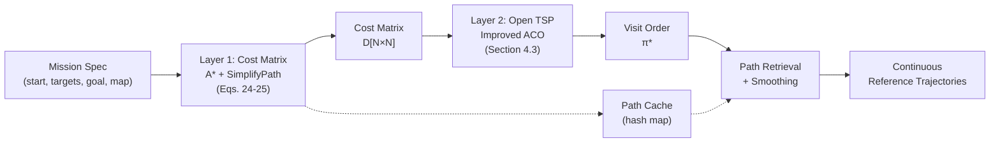

## 4.4 Collaborative Optimization Framework

The preceding sections described the two algorithmic layers in isolation: an improved A* planner with path post-processing (Sections 4.1--4.2), and an improved ACO solver for the open TSP (Section 4.3). This section describes how these layers are integrated into a unified framework for obstacle-aware multi-point traversal path planning.

### 4.4.1 Two-Layer Architecture

The framework follows a two-layer architecture that cleanly separates the geometric problem (obstacle-constrained path finding) from the combinatorial problem (visit-order optimization).

**Layer 1 — Cost matrix construction.** Given the set of $N$ points (one start, $K$ targets, one goal), a pairwise cost matrix $\mathbf{D} \in \mathbb{R}^{N \times N}$ is constructed by computing the shortest collision-free path between every ordered pair of points:

$$\mathbf{D}(i, j) = L\big(\text{A*}(p_i, p_j, \mathbf{M})\big) \quad \forall i \neq j \in \{1, \dots, N\} \quad (24)$$

where $L(\cdot)$ is the path length function and $\mathbf{M}$ is the occupancy grid map. The diagonal entries are zero. Critically, $\mathbf{D}$ is **not** a Euclidean distance matrix: each entry encodes the actual obstacle-constrained shortest-path distance, which can be significantly larger than the straight-line distance when obstacles obstruct the direct path between two points.

When the `enableSimplify` flag is active, the path length $L(\cdot)$ is computed on the simplified rather than the raw grid path:

$$\mathbf{D}_{\text{simplified}}(i, j) = L_{\text{Euclidean}}\big(\textsc{SimplifyPath}(\text{A*}(p_i, p_j, \mathbf{M}), \mathbf{M}, d_{\text{safe}})\big) \quad (25)$$

where $L_{\text{Euclidean}}$ measures the Euclidean length of the simplified polyline, which is closer to the true continuous-path length than the grid-based Manhattan-plus-diagonal metric. This improves the accuracy of cost comparisons between alternative visitation orders.

The cost matrix construction requires $\mathcal{O}(N^2)$ invocations of the global planner. An optional external path cache (implemented as a hash map keyed by the start-goal coordinate pair) stores intermediate results, avoiding redundant A* calls when the same point pair is queried multiple times across different TSP invocations.

**Layer 2 — TSP ordering.** The cost matrix $\mathbf{D}$ is passed to the improved ACO solver (Section 4.3), which operates purely on the numerical matrix. The ACO returns an optimal visit order $\boldsymbol{\pi}^* = (1, \pi_2, \dots, \pi_{K+1}, N)$ and its total cost $C(\boldsymbol{\pi}^*)$. The solver has no awareness of obstacles, maps, or path geometry—all obstacle-related information is encoded in $\mathbf{D}$.

### 4.4.2 Pipeline Integration

The integration procedure follows a four-stage pipeline:

**Stage 1 — Point set assembly.** The $N = K + 2$ points are assembled into a single coordinate array $\mathbf{P} = [p_{\text{start}};\; \mathbf{T}_1; \dots; \mathbf{T}_K;\; p_{\text{goal}}]$, with the convention that index $1$ is the start and index $N$ is the goal.

**Stage 2 — Cost matrix construction.** For every ordered pair $(i, j)$ with $i \neq j$, the global planner computes the shortest collision-free path from $\mathbf{P}(i,:)$ to $\mathbf{P}(j,:)$. The resulting path is stored in a path cache. Its length is assigned to $\mathbf{D}(i, j)$ according to the selected cost mode:
- With `enableSimplify`, the path is first simplified (Section 4.2.1) and its Euclidean length is used (Eq. 25), yielding costs closer to the true continuous travel distance.
- Without simplification, the raw grid path length under the Manhattan-plus-diagonal metric is used (Eq. 24).

Unreachable pairs leave $\mathbf{D}(i, j) = \infty$. If any target point is unreachable from the start, the procedure aborts early and reports failure.

**Stage 3 — TSP solving.** The cost matrix $\mathbf{D}$ and total point count $N$ are passed to the improved ACO solver (Section 4.3), which returns the optimal visit order $\text{bestOrder} = (1, \dots, N)$ and its associated total cost. In the trivial case $K = 0$ (no intermediate targets), the order is simply $[1, N]$ with cost $\mathbf{D}(1, N)$.

**Stage 4 — Output assembly.** The ordered point coordinates are extracted as $\mathbf{P}(\text{bestOrder}, :)$. Segment paths are retrieved from the path cache for each consecutive pair in `bestOrder`, producing the final set of obstacle-safe reference paths ready for smoothing and robot execution.

### 4.4.3 Design Rationale

The two-layer separation provides three key benefits:

**1. Algorithmic decoupling.** The global planner and the TSP solver can be developed, tested, and improved independently. Any grid-based planner (A*, Dijkstra, RRT) can substitute into Layer 1, and any permutation optimizer (ACO, GA, SA) can substitute into Layer 2. This modularity is demonstrated in the experiments (Sections 5.2--5.3), where each layer is benchmarked against alternative implementations while the other layer is held fixed.

**2. Obstacle encoding via the cost matrix.** The cost matrix $\mathbf{D}$ serves as a compact interface: it captures the full obstacle-constrained distance topology in an $N \times N$ matrix, regardless of map complexity. The TSP solver inherits obstacle awareness for free—it never consults the occupancy grid directly, yet every pair of points is guaranteed a collision-free path (if one exists). This encoding is lossy in the sense that the TSP solver cannot reason about path geometry (e.g., whether two segment paths share a corridor), but it is complete for the purpose of cost minimization.

**3. Cost accuracy through simplification.** The `enableSimplify` flag controls a crucial design trade-off. When disabled, costs are computed on raw grid paths using the grid metric (cardinal edges cost 1, diagonal edges cost $\sqrt{2}$), which overestimates the true continuous-path length due to staircase artifacts. When enabled, paths are first simplified (removing zigzag waypoints via Section 4.2.1) and costs are computed as Euclidean lengths on the simplified polyline. This produces a cost matrix closer to physical travel distance, at the modest additional computational cost of the $\textsc{SimplifyPath}$ call per point pair. In practice, the simplified costs enable the TSP solver to make finer distinctions between alternative orderings, particularly in scenarios where multiple targets lie along the same corridor and the raw grid cost over-penalizes small alignment differences.

### 4.4.4 Complete System Flow

The end-to-end system operates as follows. Given a mission specification (start point, target set, goal point, and grid map), the framework:

1. **Constructs the cost matrix** by calling the improved A* planner on all $\mathcal{O}(N^2)$ point pairs, optionally simplifying paths before cost evaluation.
2. **Solves the open TSP** using the improved ACO to determine the optimal visitation order.
3. **Retrieves the segment paths** from the path cache and assembles the complete ordered trajectory.
4. **Applies the post-processing pipeline** (SimplifyPath + SmoothPath, Section 4.2) to each segment path, producing a set of smooth, obstacle-safe continuous trajectories for robot execution.

*[Figure 5: System architecture overview diagram showing the complete pipeline: mission specification → Layer 1 (A* + SimplifyPath → cost matrix with path cache) → Layer 2 (ACO → visit order) → Path post-processing (SimplifyPath + SmoothPath) → continuous reference trajectories for robot execution.]*

