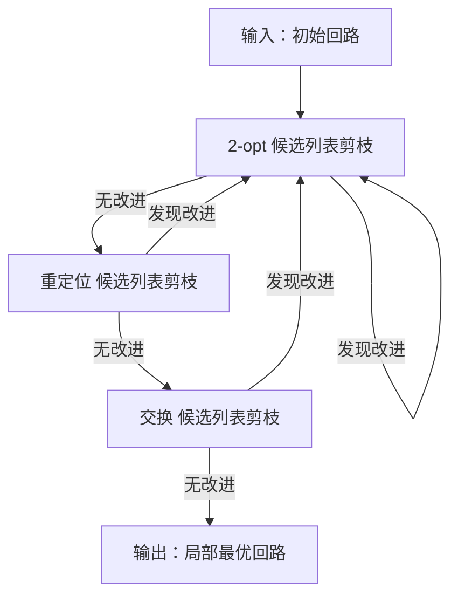
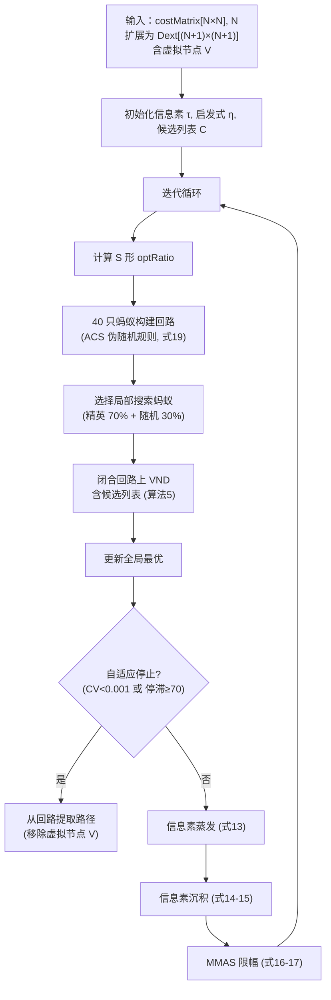

## 4.3 改进的开放旅行商蚁群优化

本框架的第二层在全局规划层产生的代价矩阵上求解开放旅行商问题。给定由固定起点$S$、$K$个中间目标点$\{T_1, \dots, T_K\}$和固定终点$G$组成的$N$个点，目标是找到使总路径代价最小的$K$个目标点排列。我们在蚁群优化（ACO）元启发式方法基础上引入六个集成机制：（1）虚拟节点法，将开放旅行商问题转化为标准闭环旅行商问题；（2）最大-最小蚁群系统（MMAS）信息素管理及动态更新边界；（3）蚁群系统（ACS）风格的伪随机比例转移规则，平衡探索与利用；（4）以$k$近邻候选列表加速的可变邻域下降（VND）局部搜索；（5）S形渐进调度策略，将搜索从探索主导逐渐转向利用主导；（6）自适应停止准则。

### 4.3.1 虚拟节点法编码开放旅行商问题

**动机。** 在标准闭环旅行商问题中，解为哈密顿回路，任意城市均可作为起始点。在我们的问题中，起点$S$和终点$G$是由任务规格确定的物理上不同的位置——例如无人公交的始发站和终点站。这两个点必须出现在每个候选解的固定位置（首尾），优化仅针对$K$个中间目标点的排序进行。将所有$N$个点对称排列的朴素编码会产生将起点/终点混入路径中间的无效路径；而将起点/终点固定在路径两端的边界固定编码将其排除在信息素模型和局部搜索之外，限制了算法对完整解的优化能力。

**机制。** 我们采用虚拟节点（哑节点）法将开放旅行商问题转化为标准闭环旅行商问题，该技术在开放车辆路径问题中被广泛采用 [31], [32]。引入虚拟节点$V = N + 1$，构造$(N+1) \times (N+1)$的扩展代价矩阵$\mathbf{D}_{\text{ext}}$：

$$\mathbf{D}_{\text{ext}}(i, j) = \begin{cases}
    0, & \{i, j\} = \{V, 1\} \text{（虚拟节点 ↔ 起点）} \\
    0, & \{i, j\} = \{V, N\} \text{（虚拟节点 ↔ 终点）} \\
    \text{BIG}, & i = V \text{ 或 } j = V, \text{ 且 } \{i, j\} \cap \{1, N\} = \varnothing \\
    \mathbf{D}(i, j), & \text{其他}
\end{cases} \quad (10)$$

其中$\text{BAD} = 2(N+1) \cdot \max_{i,j} \mathbf{D}(i,j)$为严格大于任何可行回路代价的惩罚值，确保虚拟节点在任何近优回路中不直接连接任何中间目标点。虚拟节点与起点/终点之间的零代价边使虚拟节点对路径代价"不可见"，而与中间目标点之间的惩罚边强制虚拟节点仅与起点和终点相邻。

蚁群优化求解器在扩展代价矩阵$\mathbf{D}_{\text{ext}}$上作为标准闭环旅行商问题运行：所有蚂蚁构建访问所有$N+1$个节点（包括虚拟节点）的完整哈密顿回路，信息素矩阵$\boldsymbol{\tau}$覆盖完整的$(N+1) \times (N+1)$空间。求解器收敛后，通过以下步骤从最优回路中提取开放路径访问顺序：

1. 定位回路中的虚拟节点$V$。
2. 移除$V$并按回路顺序读取剩余$N$个节点。
3. 调整方向使起点（1）出现在首位、终点（$N$）出现在末位。

该转换相对边界固定编码有三个优势：（a）起点和终点节点完整参与信息素模型和局部搜索，而非被排除为固定边界；（b）所有标准闭环旅行商算子（2-opt、重定位、交换）统一适用，无需特殊边界处理；（c）代价评估为$\mathbf{D}_{\text{ext}}$上的简单回路求和，避免了单独边界代价项的需求。

启发式可见度矩阵$\boldsymbol{\eta}$在扩展空间上定义。对涉及虚拟节点的点对，到起点/终点的零代价边赋予大启发式值$\eta_{V,1} = \eta_{1,V} = \eta_{V,N} = \eta_{N,V} = \text{BIG}$，强烈吸引虚拟节点连接其所需邻居。对其他点对：

$$\eta_{ij} = \begin{cases}
    1 / \mathbf{D}_{\text{ext}}(i,j), & \mathbf{D}_{\text{ext}}(i,j) > 0 \text{ 且 } \mathbf{D}_{\text{ext}}(i,j) < \infty \\
    0, & \text{其他}
\end{cases} \quad (11)$$

闭合回路$\boldsymbol{\sigma} = (\sigma_1, \sigma_2, \dots, \sigma_{N+1})$的代价为：

$$C(\boldsymbol{\sigma}) = \sum_{k=1}^{N} \mathbf{D}_{\text{ext}}(\sigma_k, \sigma_{k+1}) + \mathbf{D}_{\text{ext}}(\sigma_{N+1}, \sigma_1) \quad (12)$$

### 4.3.2 具有动态边界的最大-最小蚁群系统信息素更新

**动机。** 在基本蚁群系统中，所有蚂蚁在其完整路径上沉积信息素，当少数蚂蚁偶然找到中等质量的路径时可能导致搜索过早集中于次优解。反之，无边界的过度蒸发可能使信息素值在除主导边之外的所有边上趋近于零，将种群困在局部最优。最大-最小蚁群系统（MMAS）[23] 通过以下方式解决这两个问题：（a）将信息素限制在显式区间$[\tau_{\min}, \tau_{\max}]$内，防止支配和灭绝；（b）聚焦于最优性能解的沉积。

**机制。** 每次迭代，所有信息素值首先进行蒸发：

$$\tau_{ij} \leftarrow (1 - \rho) \cdot \tau_{ij} \quad \forall i, j \in \{1, \dots, N+1\} \quad (13)$$

其中$\rho = 0.25$为蒸发率。蒸发后，在两个解层次的边上沉积信息素：

**迭代最优沉积。** 当代最优蚂蚁在其回路的所有边上沉积信息素：

$$\tau_{ij} \leftarrow \tau_{ij} + \frac{Q}{C_{\text{iter}}} \quad \forall (i, j) \in \text{edges}(\boldsymbol{\sigma}_{\text{iter-best}}) \quad (14)$$

**全局最优精英沉积。** 搜索开始以来找到的最优回路也获得沉积，强化全局主导解：

$$\tau_{ij} \leftarrow \tau_{ij} + \frac{Q}{C_{\text{global}}} \quad \forall (i, j) \in \text{edges}(\boldsymbol{\sigma}_{\text{global-best}}) \quad (15)$$

其中$Q = 225$为沉积常数，$C$为回路代价。沉积量与回路代价成反比，因此更短（更优）的回路沉积更强的信息素。两个沉积级别同时应用于对称对$(j, i)$，保持无向信息素模型。

沉积后，所有信息素值被限幅到$[\tau_{\min}, \tau_{\max}]$区间，其边界根据当前全局最优动态更新：

$$\tau_{\max} = \frac{1}{\rho \cdot C_{\text{global}}} \quad (16)$$

$$\tau_{\min} = \frac{\tau_{\max}}{N+1} = \frac{1}{\rho \cdot (N+1) \cdot C_{\text{global}}} \quad (17)$$

并设有硬下限$\tau_{\min} \geq 10^{-6}$以防止低频边上信息素完全灭绝。边界的动态更新至关重要：随着搜索发现更优回路（$C_{\text{global}}$减小），$\tau_{\max}$增大，允许算法对其当前最优解表达更强的置信。反之，比率$\tau_{\min}/\tau_{\max} = 1/(N+1)$维持最小与最大信息素之间的恒定相对间隔，无论绝对尺度如何，都为所有边保持基线探索概率。

初始信息素矩阵设为均匀值$\tau_0 = 0.1$，表示搜索经验积累前的中性先验。

### 4.3.3 蚁群系统风格的伪随机转移规则

**动机。** 在标准蚁群系统中，每只蚂蚁通过纯概率轮盘选择从未访问的候选集中选择下一节点。此方法探索性强，在距离启发式提供可靠引导的结构化问题上收敛缓慢。蚁群系统（ACS）[6] 通过伪随机比例规则解决此问题：以可控概率，蚂蚁贪心地选择最优候选；否则通过标准概率机制探索。这平衡了收敛需求（利用）与避免局部最优的需求（探索）。

**机制。** 当蚂蚁在当前节点$u$从未访问候选集$\mathcal{U}$中选择下一节点时，首先计算每个候选的得分：

$$\text{score}(v) = (\tau_{uv})^{\alpha} \cdot (\eta_{uv})^{\beta} \quad \forall v \in \mathcal{U} \quad (18)$$

其中$\alpha = 1$和$\beta = 2.0$分别为信息素和启发式权重指数。转移决策遵循：

$$v_{\text{next}} = \begin{cases}
    \arg\max_{v \in \mathcal{U}} \; \text{score}(v), & \text{概率 } q_0 \\
    \text{roulette}(\mathcal{U}, \text{score}), & \text{概率 } 1 - q_0
\end{cases} \quad (19)$$

其中$q_0 = 0.45$为利用概率。在利用情形中，蚂蚁确定性地选择得分最高的候选——等价于贪心最优步。在探索情形中，蚂蚁执行轮盘选择，每个候选$v$以$\text{score}(v) / \sum_{u \in \mathcal{U}} \text{score}(u)$的概率被选中。若所有得分为零（所有剩余节点不可达），随机选择一个未访问候选作为回退。

$q_0 = 0.45$意味着平均而言，45%的构建步使用贪心选择加速收敛，而55%通过随机探索维持多样性。此比率的设定基于障碍约束代价矩阵的结构化特性——点对间距离通常表现出空间局部性，启发式$\eta$携带可靠信息。

### 4.3.4 具有候选列表加速的可变邻域下降局部搜索

**动机。** 蚂蚁构建的路径虽然受信息素和启发式信息引导，但不能保证局部最优。对每代最优蚂蚁施加局部搜索，通过系统性地探索邻域排列来精化解。可变邻域下降（VND）[24] 依次应用多个邻域结构，每种捕捉不同类型的路径变换，循环直至无结构能产生进一步改进。混合MMAS-VND和ACS-VND方案在车辆路径问题中已展现出强劲性能 [25]。然而，标准VND对每个算子检查$O(K^2)$邻域，在大规模实例上成为计算瓶颈。此外，大多数此类检查的移动是无效的——远距节点的候选对不太可能产生改进的2-opt交换。

**机制。** 我们的VND在所有$N+1$个节点（包括虚拟节点）的闭合回路上操作，按固定顺序采用三个邻域算子：

1. **2-opt**：反转路径的连续子序列，用$(u, v)$和$(u^+, v^+)$替换$(u, u^+)$和$(v, v^+)$。这消除欧氏型代价结构中的路径交叉。

2. **重定位**：从当前位置提取单个节点并重新插入到回路中的不同位置，平移中间节点。这修正节点属于路径不同区域的局部错序。

3. **交换**：交换两个节点的位置，保持所有其他节点固定。这处理两个节点被分配到彼此最优位置的情况。

三个算子在VND循环中采用首次改进（FI）策略：2-opt反复应用直至无改进，然后是重定位，然后是交换。若任一算子产生改进，循环重置回2-opt并重复。当三个算子连续未能改进解时搜索终止。

**候选列表加速。** 关键效率改进是使用预计算的候选列表剪枝无前景的邻域评估，该策略在旅行商问题局部搜索中已被广泛采用 [26]。对扩展问题中的每个$N+1$节点，我们基于扩展代价矩阵$\mathbf{D}_{\text{ext}}$预计算$k = 9$个最近邻，并将其存储为布尔矩阵$\mathbf{C}$，其中$\mathbf{C}(i, j) = \text{true}$表示节点$j$是节点$i$的$k$个最近邻之一。三个VND算子的剪枝规则如下：

- **2-opt剪枝**：仅当所提议的新边$(u, v)$或$(u^+, v^+)$中至少一对是候选邻居时，才评估候选2-opt移动。
- **重定位剪枝**：仅当被移动节点$v$是其新相邻节点之一$p$或$p^+$的候选邻居时，才评估将节点$v$插入$p$之后的移动。
- **交换剪枝**：仅当被交换的两个节点$a$和$b$互为候选邻居时，才评估交换操作。

剪枝在设计上是保守的：仅当移动的新边均不涉及候选对时才跳过评估——这是移动不太可能改进回路的强但非绝对信号。较小的候选列表大小$k = 9$旨在积极过滤评估，同时保留最有可能的局部移动；这在扩展代价矩阵表现出强空间结构时尤为有效，仅有邻近节点可能参与改进的边交换。

**复杂度。** 无剪枝时，每个VND算子检查$O((N+1)^2)$个候选移动。通过候选列表剪枝，每个节点仅参与$O(k)$次邻域检查，将每算子复杂度降至$O((N+1) \cdot k)$。对于典型问题规模（$N \approx 100$，$k = 9$），这代表约$10\times$的缩减；差距随$N$呈二次增长。

---

**Algorithm 5: Candidate-list-accelerated variable neighborhood descent**

**Input:** closed tour $\boldsymbol{\sigma} = [\sigma_1, \dots, \sigma_{N+1}]$, extended cost matrix $\mathbf{D}_{\text{ext}}$, candidate boolean matrix $\mathbf{C}$

**Output:** improved tour $\boldsymbol{\sigma}$ and its cost

1:  $\text{cost} \gets$ the cost of tour $\boldsymbol{\sigma}$ under $\mathbf{D}_{\text{ext}}$;
2:  **repeat**
3:  $\quad$ improved $\gets$ false;
4:  $\quad$ $[\boldsymbol{\sigma}, \text{cost}, \text{ok}] \gets$ apply the 2-opt operator with candidate-list pruning (first-improvement);
5:  $\quad$ improved $\gets$ improved or ok;
6:  $\quad$ $[\boldsymbol{\sigma}, \text{cost}, \text{ok}] \gets$ apply the relocate operator with candidate-list pruning;
7:  $\quad$ improved $\gets$ improved or ok;
8:  $\quad$ $[\boldsymbol{\sigma}, \text{cost}, \text{ok}] \gets$ apply the swap operator with candidate-list pruning;
9:  $\quad$ improved $\gets$ improved or ok;
10: **until** improved = false;
11: $\text{cost} \gets$ the exact cost of the final tour $\boldsymbol{\sigma}$;
12: **return** $\boldsymbol{\sigma}$, $\text{cost}$;

---

邻域算子（TwoOptClosed、RelocateClosed、SwapClosed）各自采用首次改进策略——首个发现降低回路代价的移动被立即接受，算子返回。闭合回路拓扑要求交换算子特殊处理：当交换跨越回路闭合边的两个相邻节点（即回路最后一个和第一个元素）时，标准线性邻接逻辑必须考虑环绕连接。

*[图3：VND邻域搜索序列流程图——展示2-opt → 重定位 → 交换 → 循环循环及各算子的候选列表剪枝。]*

### 4.3.5 S形渐进局部搜索调度

**动机。** 即使有候选列表加速，VND局部搜索的计算代价意味着在每代对每只蚂蚁施加局部搜索会浪费早期世代的资源——此时种群尚未识别出搜索空间中有前景的区域。反之，在后期世代中，当信息素已收敛至高质量解时，密集局部搜索对精细调优至关重要。在整个运行过程中对固定比例的蚂蚁施加局部搜索是次优的：比例过低导致收敛停滞，比例过高则在低质量路径上浪费计算。

**机制。** 我们根据S形（sigmoid）函数在迭代预算内调度接收VND局部搜索的蚂蚁比例：

$$\text{optRatio}(t) = y_{\min} + (y_{\max} - y_{\min}) \cdot \frac{t^a}{t^a + (1 - t)^a} \quad (20)$$

其中$t = (\text{iter} - x_L) / (x_R - x_L)$为转换区间$[x_L, x_R] = [0, 30]$内的归一化迭代位置。参数为：$y_{\min} = 0.0$（最开始无局部搜索），$y_{\max} = 0.4$（后期最多40%的蚂蚁接收局部搜索），$a = 2.0$（S形曲线陡度）。$x_L$之前，$\text{optRatio} = y_{\min}$；$x_R$之后，$\text{optRatio} = y_{\max}$；区间内比率遵循平滑sigmoid过渡。

S形曲线提供三个理想特性：（1）早期迭代（$\text{optRatio} \approx 0$），种群广泛探索而不承担局部搜索的计算代价，纯依赖构建层面的多样化；（2）过渡阶段，优化蚂蚁比例逐渐增加，允许信息素适应改进的解；（3）后期迭代（$\text{optRatio} = 0.4$），相当比例的蚂蚁接收局部搜索，同时部分蚂蚁继续通过构建探索，维持多样性。转换区间$[0, 30]$有意设置较短：S形曲线尽早达到最大值，反映了在基本信息素结构建立后（约30次迭代后）密集局部搜索从一开始就有效的观察。

*[图4：S形$\text{optRatio}(t)$关于迭代次数的曲线图，展示三个区间：迭代0之前平坦于0，迭代0至30的sigmoid过渡，迭代30之后平坦于0.4。]*

**局部搜索蚂蚁选择。** 确定接收局部搜索的蚂蚁数量$n_{\text{opt}} = \lceil n_{\text{ants}} \cdot \text{optRatio} \rceil$后，选择哪些具体蚂蚁接收优化采用精英-随机混合策略：

$$n_{\text{elite}} = \lceil n_{\text{opt}} \cdot r_{\text{elite}} \rceil \quad (21)$$

$$n_{\text{random}} = n_{\text{opt}} - n_{\text{elite}} \quad (22)$$

其中$r_{\text{elite}} = 0.7$（局部搜索预算的前70%分配给排名最高的蚂蚁），剩余$n_{\text{random}}$只蚂蚁从非精英池中随机选择。此选择确保最优解被精化（精英利用），同时少数随机选择的蚂蚁路径被优化，可能发现精英池忽略的搜索空间中其他高质量区域（受控探索）。

### 4.3.6 自适应停止准则

**动机。** 最大迭代次数$n_{\text{iter}} = 800$保守地设定以适应困难问题实例。在较易实例上，种群可能远早于此收敛，继续运行浪费计算而不改进解。反之，过早终止有遗漏最优解的风险。自适应停止机制应检测真正的收敛，同时防止因暂时停滞导致的过早终止。

**机制。** 监测两个互补的收敛指标：

**条件1——种群同质性。** 当蚁群收敛至搜索空间的狭窄区域时，蚂蚁间的代价方差变得很小。我们通过每代蚂蚁代价的变异系数（CV）衡量：

$$\text{CV} = \frac{\sigma_{\text{costs}}}{\mu_{\text{costs}}} \quad (23)$$

其中$\sigma_{\text{costs}}$和$\mu_{\text{costs}}$分别为当代所有蚂蚁回路代价的标准差和均值。若$\text{CV} < 0.001$，种群被视为同质——所有蚂蚁产生几乎相同质量的回路，进一步迭代不太可能发现新解。

**条件2——最优解停滞。** 即使种群保持多样，全局最优回路也可能陷入局部最优。我们跟踪全局最优代价未改进的连续迭代次数。若停滞计数器达到$70$代，搜索终止。

**最小保护。** 两个条件仅在$\text{minIter} = 30$次迭代后激活，确保种群在收敛监测开始前有足够时间建立有意义的信息素结构。这防止在初始探索阶段——代价方差自然较高且全局最优仍在快速改进时——的过早终止。

---

### 4.3.7 集成总结

完整的蚁群优化程序将上述六个机制集成到单一迭代搜索循环中。算法在扩展代价矩阵$\mathbf{D}_{\text{ext}}$上于$N+1$个节点（包括虚拟节点）的空间中运行。每次迭代按以下步骤进行：

1. S形曲线（式20）确定接收局部搜索的蚂蚁比例。
2. 所有$40$只蚂蚁使用ACS风格的伪随机转移规则（式18-19）构建完整的$N+1$节点哈密顿回路。
3. 精英-随机混合选择（式21-22）选择哪些蚂蚁接收具有候选列表加速的VND局部搜索（算法5）。
4. 更新全局最优回路并检查自适应停止准则（式23）。
5. 信息素蒸发（式13）并在迭代最优和全局最优回路上沉积（式14-15），随后进行动态MMAS边界限幅（式16-17）。

当种群代价变异系数降至$0.001$以下或全局最优回路连续$70$代停滞时搜索终止，两个检查均仅在最少$30$次迭代后激活。终止后，通过在最优回路中定位并移除虚拟节点$V$，然后调整剩余序列使起点（1）在前、终点（$N$）在后来组装最终的开放路径访问顺序。

*[图4：改进蚁群优化总体流程图。]*

