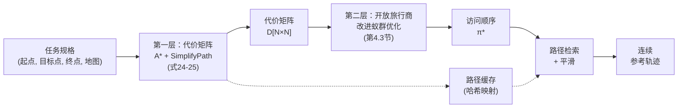

## 4.4 协同优化框架

前述各节分别描述了两个算法层：改进的A*规划器与路径后处理（第4.1-4.2节），以及面向开放旅行商问题的改进蚁群优化求解器（第4.3节）。本节描述如何将这两个层集成为面向障碍环境多目标点遍历路径规划的统一框架。

### 4.4.1 两层架构

该框架遵循两层架构，清晰分离几何问题（障碍约束路径寻找）与组合问题（访问顺序优化）。

**第一层——代价矩阵构建。** 给定$N$个点（一个起点、$K$个目标点、一个终点），通过计算每对点之间的最短无碰撞路径构建成对代价矩阵$\mathbf{D} \in \mathbb{R}^{N \times N}$：

$$\mathbf{D}(i, j) = L\big(\text{A*}(p_i, p_j, \mathbf{M})\big) \quad \forall i \neq j \in \{1, \dots, N\} \quad (24)$$

其中$L(\cdot)$为路径长度函数，$\mathbf{M}$为占用栅格地图。对角元素为零。关键的是，$\mathbf{D}$**不是**欧氏距离矩阵：每个元素编码了真实的障碍约束最短路径距离，当障碍物阻断两点之间的直接路径时，该距离可能显著大于直线距离。

当`enableSimplify`标志激活时，路径长度$L(\cdot)$基于简化后的而非原始栅格路径计算：

$$\mathbf{D}_{\text{simplified}}(i, j) = L_{\text{Euclidean}}\big(\textsc{SimplifyPath}(\text{A*}(p_i, p_j, \mathbf{M}), \mathbf{M}, d_{\text{safe}})\big) \quad (25)$$

其中$L_{\text{Euclidean}}$为简化折线的欧氏长度，其比栅格曼哈顿加对角线度量更接近真实连续路径长度。代价矩阵构建需要$O(N^2)$次全局规划器调用。可选的外部路径缓存（以起终坐标对为键的哈希映射）存储中间结果，避免在不同旅行商调用之间重复的A*计算。

**第二层——旅行商排序。** 代价矩阵$\mathbf{D}$传递给改进的蚁群优化求解器（第4.3节），后者纯在数值矩阵上操作。蚁群优化返回最优访问顺序$\boldsymbol{\pi}^* = (1, \pi_2, \dots, \pi_{K+1}, N)$及其总代价$C(\boldsymbol{\pi}^*)$。求解器不感知障碍物、地图或路径几何——所有障碍相关信息均编码在$\mathbf{D}$中。

### 4.4.2 管线集成

集成流程按四个阶段进行：

**阶段1——点集组装。** $N = K + 2$个点组装为单一坐标数组$\mathbf{P} = [p_{\text{start}};\; \mathbf{T}_1; \dots; \mathbf{T}_K;\; p_{\text{goal}}]$，约定索引$1$为起点、索引$N$为终点。

**阶段2——代价矩阵构建。** 对每对有序点$(i, j)$（$i \neq j$），全局规划器计算从$\mathbf{P}(i,:)$到$\mathbf{P}(j,:)$的最短无碰撞路径。所得路径存入路径缓存，其长度根据所选代价模式赋值给$\mathbf{D}(i, j)$：
- 启用`enableSimplify`时，路径先经简化（第4.2.1节）再取欧氏长度（式25），产生更接近真实连续旅行距离的代价。
- 不启用简化时，使用原始栅格路径在曼哈顿加对角线度量下的长度（式24）。

不可达对保留$\mathbf{D}(i, j) = \infty$。若任何目标点从起点不可达，流程提前终止并报告失败。

**阶段3——旅行商求解。** 代价矩阵$\mathbf{D}$和总点数$N$传递给改进的蚁群优化求解器（第4.3节），返回最优访问顺序$\text{bestOrder} = (1, \dots, N)$及其总代价。在$K = 0$（无中间目标点）的平凡情况下，顺序为$[1, N]$，代价为$\mathbf{D}(1, N)$。

**阶段4——输出组装。** 有序点坐标提取为$\mathbf{P}(\text{bestOrder}, :)$。对`bestOrder`中每对连续点从路径缓存检索段路径，生成最终的障碍安全参考路径集，供平滑和机器人执行使用。

### 4.4.3 设计原理

两层分离提供三个关键优势：

**1. 算法解耦。** 全局规划器和旅行商求解器可独立开发、测试和改进。任何基于栅格的规划器（A*、Dijkstra、RRT）可替换到第一层，任何排列优化器（蚁群优化、遗传算法、模拟退火）可替换到第二层。此模块化在实验（第5.2-5.4节）中得到验证——每层针对替代实现进行基准测试，同时另一层保持固定。

**2. 通过代价矩阵编码障碍信息。** 代价矩阵$\mathbf{D}$作为紧凑接口：无论地图复杂度如何，它将完整的障碍约束距离拓扑捕获在$N \times N$矩阵中。旅行商求解器免费继承障碍感知——它从不直接查询占用栅格，但每对点都保证有无碰撞路径（若存在）。此编码在旅行商求解器无法推理路径几何（例如两段路径是否共享走廊）的意义上是有损的，但对于代价最小化目的是完备的。

**3. 通过简化提升代价精度。** `enableSimplify`标志控制一个关键的设计权衡。禁用时，代价基于原始栅格路径在栅格度量下计算（正交边代价1，对角边代价$\sqrt{2}$），因阶梯伪影而高估真实连续路径长度。启用时，路径先经简化（通过第4.2.1节去除锯齿航点）再以简化折线的欧氏长度计算代价。这产生更接近物理旅行距离的代价矩阵，以每对点对调用$\textsc{SimplifyPath}$的适度额外计算代价为代价。

### 4.4.4 完整系统流程

端到端系统按以下步骤运行：

1. **构建代价矩阵**：对所有$O(N^2)$个点对调用改进的A*规划器，可选地在代价评估前简化路径。
2. **求解开放旅行商问题**：使用改进的蚁群优化确定最优访问顺序。
3. **检索段路径**：从路径缓存中组装完整有序轨迹。
4. **应用后处理管线**：对每段路径应用SimplifyPath + SmoothPath（第4.2节），生成供机器人执行使用的平滑、障碍安全的连续轨迹。

*[图5：系统架构总图，展示完整管线：任务规格→第一层（A* + SimplifyPath→带路径缓存的代价矩阵）→第二层（蚁群优化→访问顺序）→路径后处理（SimplifyPath + SmoothPath）→连续参考轨迹。]*

